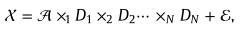

**摘要：**非参数贝叶斯技术已经应用于一维字典学习，使用β过程进行稀疏表示。然而，在现实世界中，信号往往是高维张量，并具有一些结构化特征。在这篇文章中，我们将非参数贝叶斯技术推广到了稀疏偏好β过程先验下的结构张量字典学习。给出了张量字典学习模型的层次形式，并通过带解析更新方程的吉布抽样分析给出了推理过程。张量字典直接从高维张量数据中学习，因此可以充分利用原始样本数据的空间结构信息。所采用的非参数贝叶斯技术允许噪声方差未知或非平稳，这种情况在许多应用中经常看到。最后，通过视频重建和图像去噪实验展示了学习张量字典的应用。

稀疏表示关键是要使用合适的字典，尽可能用稀疏系数来最准确地表示感兴趣的信号。
期望学习词典中的原子能捕捉感兴趣信号的主要特征。

***字典学习中若采用β过程的机制来处理稀疏编码，字典原子的实际数量和它们的相对重要性可以非参数地推断。***
***许多应用中，普遍的是不知道噪声方差信息.非参数贝叶斯公式适用于噪声方差未知或非平稳的大多数情况。***

前人方法：将一幅图像展开成一个1D矢量，其结构信息将被破坏，固有的像素相关性将无法保留和使用。同时，训练需要大量的样本来处理大量的待估计参数。因此，研究人员倾向于直接学习2D信号或多维数据的字典

***在这篇文章中***，我们提出了一个带β过程的张量可分字典学习模型。这篇论文的贡献有三个方面。首先，我们的词典具有可分结构，其中每种模式都有自己的词典集。因此，字典中模型参数的数量比任何非结构化字典少得多。因此，所提出的模型将需要更少的训练数据，并且在训练和测试阶段运行得更快。其次，我们的模型是一个概率模型，因此它提供了处理数据中缺失值的机会，并包含贝叶斯学习的先验知识。同时，它可以自动推断噪声方差或估计的置信度。最后，所提出的分层模型中的连续元素属于共轭指数族，因此我们通过吉布斯抽样分析来实现推理。在本文中，我们考虑使用多个beta过程来辅助张量字典学习，并提出了一个使用beta过程的张量可分字典学习模型。

~~塔克分解是主成分分析的高阶应用~~
主成分分析讲的比较好的一篇博客：[PCA](https://blog.csdn.net/murray_/article/details/79945148)

**2 <u>张量分解</u>和beta过程字典学习**
在给定所有矩阵Dn(每一维的主成分)的情况下，并不是每个张量都具有塔克形式，在所有矩阵Dn中，张量是通过核张量乘以沿着每个模式的矩阵而获得的。塔克分解是一种寻找具有适当的核心张量和矩阵的塔克形式的方法.这种表示存在误差：

有张量信号Xi，i=1，M，**x=Dα+ε**,α的稀疏性通过使用双参数β过程来实现，通过该过程来定义模型中的稀疏系数,α=Z◦W

张量稀疏字典学习算法旨在沿着每个模式找到字典Dn，在每个模式上，集合中的每个信号可以近似地表示为整个字典原子的稀疏线性组合。从数学上来说，我们的目标是使下列近似误差最小化

**3 β过程的张量字典学习模型**

**4视频恢复的时候，RGB是单独重建的，时间，宽，高，通道=1（3,但是一个一个用），相当于时间，宽，高三维，而我们的光谱图像可以直接是输入一张图片，宽，高，光谱三维来用，可以分成一个个patch，每个patch的大小可以是8*8*λ等等来学习**
