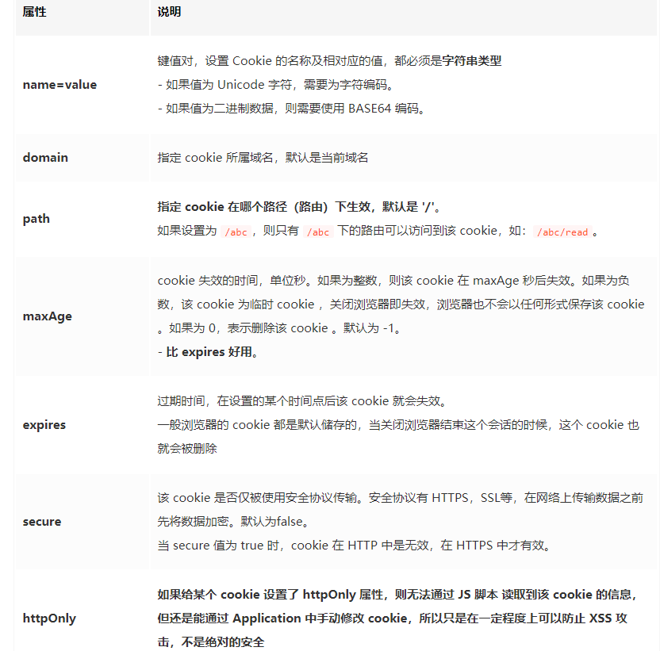

### 认证（Authentication）:验证当前用户的身份
    互联网中的认证：
        用户名密码登录
        邮箱发送登录链接
        手机号接收验证码
        只要你能收到邮箱/验证码，就默认你是账号的主人
### 授权（Authorization）:用户授予第三方应用访问该用户某些资源的权限
    实现授权的方式有：cookie、session、token、OAuth
### 凭证（Credentials）
    实现认证和授权的前提是需要一种媒介（证书） 来标记访问者的身份.
### 什么是 Cookie
- HTTP 是无状态的协议,服务器与浏览器为了进行会话跟踪（知道是谁在访问我），就必须主动的去维护一个状态，这个状态用于告知服务端前后两个请求是否来自同一浏览器,这个状态需要通过 cookie 或者 session 去实现。   
- **cookie 是不可跨域的：每个 cookie 都会绑定单一的域名，无法在别的域名下获取使用，一级域名和二级域名之间是允许共享使用的（靠的是 domain）。**
- cookie的重要属性
  
### 什么是 Session
- session 是另一种记录服务器和客户端会话状态的机制
- session 是基于 cookie 实现的，session 存储在服务器端，sessionId 会被存储到客户端的cookie 中
- session 认证流程：
    - 用户第一次请求服务器的时候，服务器根据用户提交的相关信息，创建对应的 Session
    - 请求返回时将此 Session 的唯一标识信息 SessionID 返回给浏览器
    - 浏览器接收到服务器返回的 SessionID 信息后，会将此信息存入到 Cookie 中，同时 Cookie 记录此 SessionID 属于哪个域名
    - 当用户第二次访问服务器的时候，请求会自动判断此域名下是否存在 Cookie 信息，如果存在自动将 Cookie 信息也发送给服务端，服务端会从Cookie中获取SessionID，再根据 SessionID 查找对应的 Session 信息，如果没有找到说明用户没有登录或者登录失效，如果找到 Session，证明用户已经登录可执行后面操作。
  
### Cookie 和 Session 的区别
- 安全性： Session 比 Cookie 安全，Session 是存储在服务器端的，Cookie 是存储在客户端的。
- 存取值的类型不同：Cookie 只支持存字符串数据，想要设置其他类型的数据，需要将其转换成字符串，Session 可以存任意数据类型。
- 有效期不同： Cookie可设置为长时间保持，比如我们经常使用的默认登录功能，Session 一般失效时间较短，客户端关闭（默认情况下）或者  Session 超时都会失效。
- 存储大小不同： 单个 Cookie 保存的数据不能超过 4K，Session 可存储数据远高于 Cookie，但是当访问量过多，会占用过多的服务器资源。

### 什么是 Token（令牌）
#### Acesss Token
- 访问资源接口（API）时所需要的资源凭证
- 简单 token 的组成： uid(用户唯一的身份标识)、time(当前时间的时间戳)、sign（签名，token 的前几位以哈希算法压缩成的一定长度的十六进制字符串）
- 特点：
  服务端无状态化、可扩展性好
  支持移动端设备
  安全
  支持跨程序调用

- token的身份验证流程
  1. 客户端使用用户名跟密码向服务器请求登录
  2. 服务端收到请求，去验证用户名与密码
  3. 验证成功后，服务端会签发一个 token 并把这个 token 发送给客户端
  4. 客户端收到 token 以后，会把它存储起来，比如放在 cookie 里或者 localStorage 里
  5. 客户端每次向服务端请求资源的时候需要带着服务端签发的 token
  6. 服务端收到请求，然后去验证客户端请求里面带着的 token ，如果验证成功，就向客户端返回请求的数据
  - **每一次请求都需要携带 token，需要把 token 放到 HTTP 的 Header 里**
  - **基于 token 的用户认证是一种服务端无状态的认证方式，服务端不用存放 token 数据。用解析 token 的计算时间换取 session 的存储空间，从而减轻服务器的压力，减少频繁的查询数据库**
  - **token 完全由应用管理，所以它可以避开同源策略**
#### Refresh Token
- refresh token 是专用于刷新 access token 的 token。如果没有 refresh token，也可以刷新 access token，但每次刷新都要用户输入登录用户名与密码，会很麻烦。有了 refresh token，客户端直接用 refresh token 去更新 access token，无需用户进行额外的操作。

- Access Token 的有效期比较短，当 Acesss Token 由于过期而失效时，使用 Refresh Token 就可以获取到新的 Token，如果 Refresh Token 也失效了，用户就只能重新登录了。
- Refresh Token 及过期时间是存储在服务器的数据库中，只有在申请新的 Acesss Token 时才会验证，不会对业务接口响应时间造成影响，也不需要向 Session 一样一直保持在内存中以应对大量的请求

### Token 和 Session 的区别
- Session 是一种记录服务器和客户端会话状态的机制，使服务端有状态化，可以记录会话信息。而 Token 是令牌，访问资源接口（API）时所需要的资源凭证。Token 使服务端无状态化，不会存储会话信息。
- Session 和 Token 并不矛盾，作为身份认证 Token 安全性比 Session 好，因为每一个请求都有签名还能防止监听以及重放攻击，而 Session 就必须依赖链路层来保障通讯安全了。如果你需要实现有状态的会话，仍然可以增加 Session 来在服务器端保存一些状态。
- 所谓 Session 认证只是简单的把 User 信息存储到 Session 里，因为 SessionID 的不可预测性，暂且认为是安全的。而 Token ，如果指的是 OAuth Token 或类似的机制的话，提供的是 认证 和 授权 ，认证是针对用户，授权是针对 App 。其目的是让某 App 有权利访问某用户的信息。这里的 Token 是唯一的。不可以转移到其它 App上，也不可以转到其它用户上。Session 只提供一种简单的认证，即只要有此 SessionID ，即认为有此 User 的全部权利。是需要严格保密的，这个数据应该只保存在站方，不应该共享给其它网站或者第三方 App。所以简单来说：如果你的用户数据可能需要和第三方共享，或者允许第三方调用 API 接口，用 Token 。如果永远只是自己的网站，自己的 App，用什么就无所谓了。

### 什么是 JWT
- JSON Web Token（简称 JWT）是目前最流行的<u>跨域认证</u>解决方案。
- 是一种认证授权机制。
- 可以使用 HMAC 算法或者是 RSA 的公/私秘钥对 JWT 进行签名。因为数字签名的存在，这些传递的信息是可信的.
- [JSON Web Token 入门教程](http://www.ruanyifeng.com/blog/2018/07/json_web_token-tutorial.html)

#### JWT的原理
JWT认证流程
- 用户输入用户名/密码登录，服务端认证成功后，会返回给客户端一个 JWT。
- 客户端将 token 保存到本地（通常使用 localstorage，也可以使用 cookie）。
- 当用户希望访问一个受保护的路由或者资源的时候，请求头的 Authorization 字段中使用Bearer 模式添加 JWT，其内容看起来是下面这样：
    Authorization: Bearer <token>
- 服务端的保护路由将会检查请求头 Authorization 中的 JWT 信息，如果合法，则允许用户的行为
- 因为 JWT 是自包含的（内部包含了一些会话信息），因此减少了需要查询数据库的需要
- 因为 JWT 并不使用 Cookie 的，所以你可以使用任何域名提供你的 API 服务而不需要担心跨域资源共享问题（CORS）
- 因为用户的状态不再存储在服务端的内存中，所以这是一种无状态的认证机制。
 JWT的使用方式
- 1. 当用户希望访问一个受保护的路由或者资源的时候，可以把它放在 Cookie 里面自动发送，但是这样不能跨域，所以更好的做法是放在 HTTP 请求头信息的 Authorization 字段里，使用 Bearer 模式添加 JWT。
  >GET /calendar/v1/events
    Host: api.example.com
    Authorization: Bearer <token>
  >因为 JWT 并不使用 Cookie ，所以你可以使用任何域名提供你的 API 服务而不需要担心跨域资源共享问题（CORS
- 2. 跨域的时候，可以把 JWT 放在 POST 请求的数据体里。
- 3. 通过 URL 传输:http://www.example.com/user?token=xxx ???安全吗？

#### Token和JWT的区别
>相同：
都是访问资源的令牌
都可以记录用户的信息
都是使服务端无状态化
都是只有验证成功后，客户端才能访问服务端上受保护的资源

>区别：
Token：服务端验证客户端发送过来的 Token 时，还需要查询数据库获取用户信息，然后验证 Token 是否有效。
JWT： 将 Token 和 Payload 加密后存储于客户端，服务端只需要使用密钥解密进行校验（校验也是 JWT 自己实现的）即可，不需要查询或者减少查询数据库，因为 JWT 自包含了用户信息和加密的数据

### 常见的前后端鉴权方式
- Session-Cookie
- Token 验证（包括 JWT，SSO）
- OAuth2.0（开放授权）

### 使用 cookie 时需要考虑的问题
- 因为存储在客户端，容易被客户端篡改，使用前需要验证合法性
- 不要存储敏感数据，比如用户密码，账户余额
- 使用 httpOnly 在一定程度上提高安全性
- 尽量减少 cookie 的体积，能存储的数据量不能超过 4kb
- 设置正确的 domain 和 path，减少数据传输
- <u>cookie 无法跨域</u>
- 一个浏览器针对一个网站最多存 20 个Cookie，浏览器一般只允许存放 300 个Cookie
- <u>移动端对 cookie 的支持不是很好，而 session 需要基于 cookie 实现，所以移动端常用的是 token</u>

### 使用 session 时需要考虑的问题

- 将 session 存储在服务器里面，当用户同时在线量比较多时，这些 session 会占据较多的内存，需要在服务端定期的去清理过期的session
- 当网站采用集群部署的时候，会遇到多台 web 服务器之间如何做 session 共享的问题。因为 session 是由单个服务器创建的，但是处理请求的服务器不一定是那个创建 session 的服务器，那么该服务器就无法拿到之前已经放入到 session 中的登录凭证之类的信息了
- 当多个应用要共享 session 时，除了以上问题，还会遇到跨域问题，因为不同的应用可能部署的主机不一样，需要在各个应用做好 cooki跨域的处理。
- sessionId 是存储在 cookie 中的，假如浏览器禁止 cookie 或不支持 cookie 怎么办？ 一般会把 sessionId 跟在 url 参数后面即重写url，所以 session 不一定非得需要靠 cookie 实现。
- 移动端对 cookie 的支持不是很好，而 session 需要基于 cookie 实现，所以移动端常用的是 token

### 使用 token 时需要考虑的问题

- 如果你认为用数据库来存储 token 会导致查询时间太长，可以选择放在内存当中。比如 redis 很适合你对 token 查询的需求。
- token 完全由应用管理，所以它可以避开同源策略
- <u>token 可以避免 CSRF 攻击(因为不需要 cookie 了)</u>
- 移动端对 cookie 的支持不是很好，而 session 需要基于 cookie 实现，所以移动端常用的是 token

### 使用 JWT 时需要考虑的问题
   
- 因为 JWT 并不依赖 Cookie 的，所以你可以使用任何域名提供你的 API 服务而不需要担心跨域资源共享问题（CORS）
- JWT 默认是不加密，但也是可以加密的。生成原始 Token 以后，可以用密钥再加密一次。
- JWT 不加密的情况下，不能将秘密数据写入 JWT。
- JWT 不仅可以用于认证，也可以用于交换信息。有效使用 JWT，可以降低服务器查询数据库的次数。
- JWT 最大的优势是服务器不再需要存储 Session，使得服务器认证鉴权业务可以方便扩展。但这也是 JWT 最大的缺点：由于服务器不需要- 储 Session 状态，因此使用过程中无法废弃某个 Token 或者更改 Token 的权限。也就是说一旦 JWT 签发了，到期之前就会始终有效，除- 服务器部署额外的逻辑。
- JWT 本身包含了认证信息，一旦泄露，任何人都可以获得该令牌的所有权限。为了减少盗用，JWT的有效期应该设置得比较短。对于一些比较- 要的权限，使用时应该再次对用户进行认证。
- JWT 适合一次性的命令认证，颁发一个有效期极短的 JWT，即使暴露了危险也很小，由于每次操作都会生成新的 JWT，因此也没必要保存- JWT，真正实现无状态。
- 为了减少盗用，JWT 不应该使用 HTTP 协议明码传输，要使用 HTTPS 协议传输。

### 使用加密算法时需要考虑的问题
- 绝不要以明文存储密码
- 永远使用 哈希算法 来处理密码，绝不要使用 Base64 或其他编码方式来存储密码，这和以明文存储密码是一样的，使用哈希，而不要使用编码。编码以及加密，都是双向的过程，而密码是保密的，应该只被它的所有者知道， 这个过程必须是单向的。哈希正是用于做这个的，从来没有解哈希这种说法， 但是编码就存在解码，加密就存在解密。
- 绝不要使用弱哈希或已被破解的哈希算法，像 MD5 或 SHA1 ，只使用强密码哈希算法。
- 绝不要以明文形式显示或发送密码，即使是对密码的所有者也应该这样。如果你需要 “忘记密码” 的功能，可以随机生成一个新的 一次性的（这点很重要）密码，然后把这个密码发送给用户。

### 分布式架构下 session 共享方案
1. session 复制：把改变通知到其他服务器
2. 粘性 session /IP 绑定策略：一个IP的请求都由一个服务器来处理
3. session 共享（常用）
   - 使用分布式缓存方案比如 Memcached 、Redis 来缓存 session，但是要求 Memcached 或 Redis 必须是集群
   - 把 session 放到 Redis 中存储，虽然架构上变得复杂，并且需要多访问一次 Redis ，但是这种方案带来的好处也是很大的：
     - 实现了 session 共享；
     - 可以水平扩展（增加 Redis 服务器）；
     - 服务器重启 session 不丢失（不过也要注意 session 在 Redis 中的刷新/失效机制）；
     - 不仅可以跨服务器 session 共享，甚至可以跨平台（例如网页端和 APP 端）
4. session 持久化： session 存储到数据库中
   
### 只要关闭浏览器 ，session 真的就消失了？
不对。对 session 来说，除非程序通知服务器删除一个 session，否则服务器会一直保留，程序一般都是在用户做 log off 的时候发个指令去删除 session。
然而浏览器从来不会主动在关闭之前通知服务器它将要关闭，因此服务器根本不会有机会知道浏览器已经关闭，之所以会有这种错觉，是大部分 session 机制都使用会话 cookie 来保存 session id，而关闭浏览器后这个 session id 就消失了，再次连接服务器时也就无法找到原来的 session。如果服务器设置的 cookie 被保存在硬盘上，或者使用某种手段改写浏览器发出的 HTTP 请求头，把原来的 session id 发送给服务器，则再次打开浏览器仍然能够打开原来的 session。
恰恰是由于关闭浏览器不会导致 session 被删除，迫使服务器为 session 设置了一个失效时间，当距离客户端上一次使用 session 的时间超过这个失效时间时，服务器就认为客户端已经停止了活动，才会把 session 删除以节省存储空间。

PS：如果不设置Expires的属性那么Cookie的存活时间就是在关闭浏览器的时候，或者关闭当前页面或者从当前页面跳转到其它页面cookie就失效了
cookie是服务器生成，存储在客户端浏览器（浏览器进程的内存）或者硬盘中的，它可以分为内存cookie和硬盘cookie。
如果是内存cookie，那么一旦关闭当前浏览器窗口cookie就失效了，如果是硬盘cookie，那么它是不会根据浏览器关闭而失效的，它只会根据最初设置它的生命周期的时间而失效，没到时间它就一直有效。那么内存cookie的生存周期是多久呢？一般默认是30分钟，但是这个应该是可以根据服务器端的配置而更改的。在默认的时间内，只要不关闭当前浏览器窗口，cookie就是一直有效的，但是一旦关闭当前浏览器窗口，浏览器进程就会结束，分配的内存也会被清空，cookie自然也就失效了
那么怎么样在生成cookie时设置是内存cookie还是硬盘cookie呢？如果在生成cookie时有设置cookie的最大生存时间而不是让它默认为30分钟，那么它就是硬盘cookie，如果没有设置这一步，而是默认的最大生存时间，那么它就是内存cookie。

问题：谷歌好像是为每一个页面都生成了一个子进程，所以只要关闭或者跳转走就认为是进程关闭，内存被释放了吗？所以cookie失效了？

