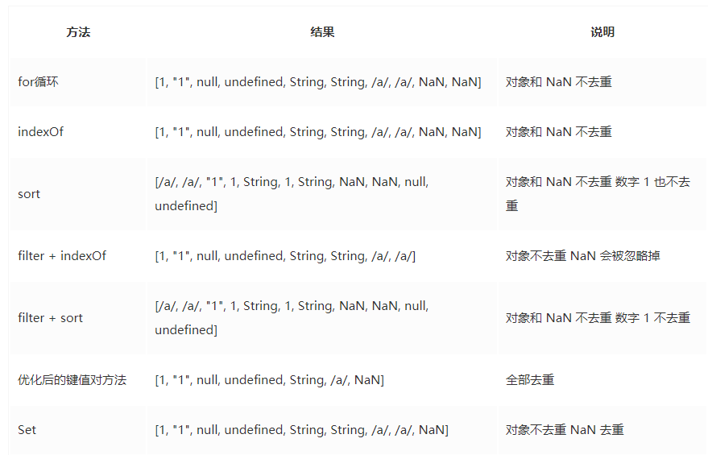

- 数组方法
  >// 1. 改变原数组
  arr.push();
  arr.pop();
  arr.unshift();
  arr.shift();
  arr.reverse();
  arr.slice();
  arr.sort();// 从小到大排序：arr.sort((a,b)=>{return a-b;}); 从大到小排序：arr.sort((a,b)=>{return b-a;});
  arr.fill();//用一个固定值填充一个数组中从起始索引到终止索引内的全部元素。不包括终止索引。
  arr.copyWithin();//用于从数组的指定位置拷贝元素到数组的另一个指定位置中
  >>  - arr.copyWithin(target, start, end)
  // target : 必选，复制到指定位置的索引值
  // start : 可选，元素复制的起始索引，缺失则从 0 开始
  // end : 可选，元素复制的结束索引，默认值是 arr.length，可取负值，表示倒数
  // 用法
  var arr = [1, 2, 3, 4, 5, 6, 7]
  console.log(arr.copyWithin(3)) // (7)[1, 2, 3, 1, 2, 3, 4]
  console.log(arr.copyWithin(3, 1)) // (7)[1, 2, 3, 2, 3, 1, 2]
  console.log(arr.copyWithin(3, 2, 5)) // (7)[1, 2, 3, 3, 2, 3, 2]
  console.log(arr.copyWithin(3, 4, 8)) // (7)[1, 2, 3, 2, 3, 2, 2]
  console.log(arr.copyWithin(3, 4, -2)) // (7)[1, 2, 3, 3, 3, 2, 2]
 
- // 2. 不改变原数组
  >arr.concat();
  arr.toString();
  arr.slice();
  arr.join();
  arr.split();
  arr.forEach();
  arr.map();
  arr.filter();
  arr.some();
  arr.every();
  arr.concat();
  arr.entries();// 方法返回一个新的Array Iterator对象，该对象包含数组中每个索引的键/值对。
  arr.findIndex();方法返回数组中满足提供的测试函数的第一个元素的索引。否则返回-1.
  arr.find(); // 方法返回数组中满足提供的测试函数的第一个元素的值。否则返回 undefined
  arr.includes();// 方法用来判断一个数组是否包含一个指定的值，根据情况，如果包含则返回 true，否则返回false。
  arr.indexOf()/lastIndexOf();
  arr.flat(); //方法会按照一个可指定的深度递归遍历数组，并将所有元素与遍历到的子数组中的元素合并为一个新数组返回。参数表示深度。

-------

- 扩展方法
  >扩展运算符(...)：转换数组为用逗号分隔的参数序列([...arr]，相当于rest/spread参数的逆运算)
  Array.from()：转换具有Iterator接口的数据结构为真正数组，返回新数组
    - 类数组对象：包含length的对象、Arguments对象、NodeList对象
    - 可遍历对象：String、Set结构、Map结构、Generator函数
  >Array.of()：转换一组值为真正数组，返回新数组
  copyWithin()：把指定位置的成员复制到其他位置，返回原数组
  find()：返回第一个符合条件的成员
  findIndex()：返回第一个符合条件的成员索引值
  fill()：根据指定值填充整个数组，返回原数组
  keys()：返回以索引值为遍历器的对象
  values()：返回以属性值为遍历器的对象
  entries()：返回以索引值和属性值为遍历器的对象
  数组空位：ES6明确将数组空位转为undefined(空位处理规不一，建议避免出现)
  使用keys()、values()、entries()返回的遍历器对象，可用for-of自动遍历或next()手动遍历
  --------
- 扩展应用
  >克隆数组：const arr = [...arr1]
  合并数组：const arr = [...arr1, ...arr2]
  拼接数组：arr.push(...arr1)
  代替apply：Math.max.apply(null, [x, y]) => Math.max(...[x, y])
  转换字符串为数组：[..."hello"]
  转换类数组对象为数组：[...Arguments, ...NodeList]
      类数组对象具有两个特性：
    - 1）具有：具有index和length属性
    - 2）不具有：不具有数组的操作方法，比如push，shift等。
  >转换可遍历对象为数组：[...String, ...Set, ...Map, ...Generator]
  与数组解构赋值结合：const [x, ...rest/spread] = [1, 2, 3]
  计算Unicode字符长度：Array.from("hello").length => [..."hello"].length


--------
- 原生方法介绍：
  Array.from()方法就是将一个类数组对象或者可遍历对象转换成一个真正的数组。
  `let dp = Array.from(new Array(5),() => new Array(2));` <u>可以得到一个5行2列的数组</u>
    
- 遍历数组的方法：
    ```
    const arr = [1, 2, 3, 4, [1, 2, 3, [1, 2, 3, [1, 2, 3]]], 5, "string", { name: "弹铁蛋同学" }];
    // 遍历数组的方法有太多，本文只枚举常用的几种
    // for 循环
    for (let i = 0; i < arr.length; i++) {
    console.log(arr[i]);
    }
    // for...of
    for (let value of arr) {
    console.log(value);
    }
    // for...in
    for (let i in arr) {
    console.log(arr[i]);
    }
    // forEach 循环
    arr.forEach(value => {
    console.log(value);
    });
    // entries（）
    for (let [index, value] of arr.entries()) {
    console.log(value);
    }
    // keys()
    for (let index of arr.keys()) {
    console.log(arr[index]);
    }
    // values()
    for (let value of arr.values()) {
    console.log(value);
    }
    // reduce()
    arr.reduce((pre, cur) => {
    console.log(cur);
    }, []);
    // map()
    arr.map(value => console.log(value));
    ```
-----
- ## **对象遍历的方法**
  对象的属性分为三种： 是否是自身属性 是否可以枚举 是否是 Symbol 属性 ; 注意：对象没有 for...of...
  > 疑问一：可枚举属性
       - 可枚举属性是指那些内部 “可枚举” 标志设置为 true 的属性。对于通过直接的赋值和属性初始化的属性，该标识值默认为即为 true。但是对于通过 Object.defineProperty 等定义的属性，该标识值默认为 false。
       - 其中js中基本包装类型的原型属性是不可枚举的，如Object, Array, Number等


  1. 使用Object.keys()遍历：返回对象自身可枚举属性键组成的数组(不含Symbol属性).
    ```
    var obj = {'0':'a','1':'b','2':'c'};
    Object.keys(obj).forEach(function(key){
       console.log(key,obj[key]);
     });
    ```
  2. for..in..遍历：遍历对象自身可继承可枚举属性(不含Symbol属性).
    ```
    var obj = {'0':'a','1':'b','2':'c'};
    for(var i in obj) {  
         console.log(i,":",obj[i]);  
    }
    ```
  3. 使用Object.getOwnPropertyNames(obj)遍历:返回一个数组,包含对象自身的所有属性(不含Symbol属性,但是包括不可枚举属性).
    ```
    var obj = {'0':'a','1':'b','2':'c'};
    Object.getOwnPropertyNames(obj).forEach(function(key){
        console.log(key,obj[key]);  
    });
    ```
  4. 使用Reflect.ownKeys(obj)遍历:返回一个数组,包含对象自身的所有属性,不管属性名是Symbol或字符串,也不管是否可枚举.
    ```
    var obj = {'0':'a','1':'b','2':'c'};
    Reflect.ownKeys(obj).forEach(function(key){   
    console.log(key,obj[key]);   
    });
    ```
  5. Object.getOwnPropertySymbols(obj)：返回一个数组，包含对象自身的所有 Symbol 属性的键名。

  - 例子：
    ```
    var a = { a: 1 };
    var b = { b: 2 };
    b.__proto__ = a;
    Object.defineProperty(b, "c", {
      value: 3
    });
    b[Symbol()] = 4;
    
    Object.keys(b); // ["b"]  返回一个数组,包括对象自身的(不含继承的)所有可枚举属性(不含Symbol属性).
    
    for (var i in b) {
      console.log(i, ":", b[i]);
    } // b : 2 a : 1   循环遍历对象自身的和继承的可枚举属性(不含Symbol属性)
    
    Object.getOwnPropertyNames(obj); // ["b", "c"] 返回一个数组,包含对象自身的所有属性(不含Symbol属性,但是包括不可枚举属性).
    Object.getOwnPropertySymbols(obj); // [Symbol()]返回一个数组，包含对象自身的所有 Symbol 属性的键名。
    Reflect.ownKeys(b); // ["b", "c", Symbol()] 返回一个数组,包含对象自身的所有属性,不管属性名是Symbol或字符串,也不管是否可枚举.
   ```
  6. Object.getOwnPropertyDescriptors()：返回对象所有自身属性(非继承属性)的描述对象

-----

- 判断元素的数组的方案
    ```
    const arr = [1, 2, 3, 4, [1, 2, 3, [1, 2, 3, [1, 2, 3]]], 5, "string", { name: "弹铁蛋同学" }];
    arr instanceof Array
    // true
    arr.constructor === Array
    // true
    Object.prototype.toString.call(arr) === '[object Array]'
    // true
    Array.isArray(arr)
    // true
    ```
    **说明**
    - instanceof 操作符是假定只有一种全局环境，如果网页中包含多个框架，多个全局环境，如果你从一个框架向另一个框架传入一个数组，那么传入的数组与在第二个框架中原生创建的数组分别具有各自不同的构造函数。（所以在这种情况下会不准确）

    - typeof 操作符对数组取类型将返回 object

    - 因为 constructor 可以被重写，所以不能确保一定是数组。
        ```
        const str = 'abc';
        str.constructor = Array;
        str.constructor === Array 
        // true
        ```

- 一维数组去重合并
   ES6:
    ```
    function unique(array) {
     return Array.from(new Set(array))
     //  return [...new Set(array)]
    }
    ```
  ```
  function combine(){ 
    let arr = [].concat.apply([], arguments);  //没有去重复的新数组 
    return Array.from(new Set(arr));
  } 

  var m = [1, 2, 2], n = [2,3,3]; 
  console.log(combine(m,n)); 
  ```

- 将数组元素展开一层的方案
    ```
    const arr = [1, 2, 3, 4, [1, 2, 3, [1, 2, 3, [1, 2, 3]]], 5, "string", { name: "弹铁蛋同学" }];
    // 扩展运算符 + concat
    [].concat(...arr)
    // [1, 2, 3, 4, 1, 2, 3, [1, 2, 3, [1, 2, 3]], 5, "string", { name: "弹铁蛋同学" }];

    // concat + apply
    [].concat.apply([], arr);
    // [1, 2, 3, 4, 1, 2, 3, [1, 2, 3, [1, 2, 3]], 5, "string", { name: "弹铁蛋同学" }]
   ```
- **实现数组展开**
  **基础版：**
  其中，arguments.callee 在哪一个函数中运行，它就代表哪一个函数。 一般用在匿名函数中。
  在匿名函数中有时会需要自己调用自己，但是由于是匿名函数，没有名，无名可调。这时就可以用arguments.callee来代替匿名的函数
  callee 属性是一个指针，指向拥有这个 arguments 对象的函数
  ```
  function flat(arr){
      let arrResult=[];
      arr.forEach(item=>{
          if(Array.isArray(item)){
              arrResult=arrResult.concat(flat(item));
              //arrResult=arrResult.concat(arguments.callee(item));
              //或者用扩展运算符
              //arrResult.push(...arguments.callee(item));
          }
          else{
              arrResult.push(item);
          }
      });
      return arrResult;
  }
    ```

  **reduce版：**
  ```
  const flat=arr=>{
      return arr.reduce((pre,cur)=>{
          return pre.concat(Array.isArray(cur)?flat(cur):cur);
      },[]);
  };
  ```
  **使用栈的思想实现 flat 函数**
  ```
  function flat(arr){
      const res=[];
      const stack=[].concat(arr);// 将数组元素拷贝至栈，直接赋值会改变原数组
      while(stack.length!==0){
          const val=stack.pop();
          if(Array.isArray(val)){
              stack.push(...val);
              //如果是数组再次入栈，并且展开了一层
          }
          else{
              result.unshift(val);//数组头部添加若干元素
          }
      }
      return result;
  }
    ```
    **通过传入整数参数控制“拉平”层数**
    ```
    function flat(arr,num=1){
        return num>0?arr.reduce((pre,cur)=>pre.concat(Array.isArray(cur)?flat(cur,num-1):cur),[]):arr.slice();
    }
    ```
    **使用 Generator 实现 flat 函数**
    ```
    function* flat(arr,num){
        if(num===undefined) num=1;
        for(const item of arr){
            if(Array.isArray(item)&&num>0){
                yield* flat(item,num-1);
            }
            else{
                yield item;
            }
        }
    }
    // 调用 Generator 函数后，该函数并不执行，返回的也不是函数运行结果，而是一个指向内部状态的指针对象。
    // 也就是遍历器对象（Iterator Object）。所以我们要用一次扩展运算符得到结果
    [...flat(arr, Infinity)]   
    ```
    **在原型链上重写 flat 函数**
    ```
    Array.prototype.fakeFlat=function (num=1){
        if(!Number(num)||Number(num)<0){
            return this;
        }
        let arr=this.concat();// 获得调用 fakeFlat 函数的数组
        while(num>0){
            if(arr.some(x=>Array.isArray(x))){
                arr=[].concat.apply([],arr);
                // apply调用concat，apply会将arr分为一个个的元素传入concat，
                // 即，[].concat(arr[0],arr[1],arr[2]...)，arr[0],arr[1],arr[2]...本身是数组或者是元素，会被concat展开一次/// 合并进空数组。
            }
            else{
                break;
                // 数组中没有数组元素并且不管 num 是否依旧大于 0，停止循环。
            }
            num--;
        }
        return arr;
    };
    arr.fakeFlat(Infinity);
    ```

- **数组去重的进化**
  ```
  双层循环
  var array = [1, 1, '1', '1'];
  function unique(array) {
      // res用来存储结果
      var res = [];
      for (var i = 0, arrayLen = array.length; i < arrayLen; i++) {
          for (var j = 0, resLen = res.length; j < resLen; j++ ) {
              if (array[i] === res[j]) {
                  break;
              }
          }
          // 如果array[i]是唯一的，那么执行完循环，j等于resLen
          if (j === resLen) {
              res.push(array[i])
          }
      }
      return res;
  }
  
  console.log(unique(array)); // [1, "1"]
  ```
-----
  ```
  indexOf版本
  var array = [1, 1, '1'];
  function unique(array) {
      var res = [];
      for (var i = 0, len = array.length; i < len; i++) {
          var current = array[i];
          if (res.indexOf(current) === -1) {
              res.push(current);
          }
      }
      return res;
  }
  console.log(unique(array));
  ```
------
  ```
  排序后去重
  function unique(array){
    var res=[];
    array.sort();
    var seen;
    for(var i=0,len=array.length;i<len;i++){
      if(!i||seen!==array[i])  { //如果是第一个元素或者相邻的元素不相同
        res.push(array[i]);
      }
      seen=array[i];
    }
    return res;
  }
  ```
------
  ```
  filter方法简化
  function unique(array){
    var res=array.filter((item,index,array)=>{
      return array.indexOf(item)===index;
    })
  }

  function unique(array){
    return array.sort().filter((item,index,array)=>{
      return !index||item!==array[index-1]
    })
  }
  ```
-----
  ```
  Object键值对
  function unique(array){
    var obj={};
    return array.filter((item,index,array)=>{
      return obj.hasOwnProperty(item) ? false:(obj[item]=true)
    })
  }
  但是由于对象的键值只能是字符串，所以1和'1'认为是重复，所以解决办法为：
  function unique(array) {
    var obj = {};
    return array.filter(function(item, index, array){
        return obj.hasOwnProperty(typeof item + item) ? false : (obj[typeof item + item] = true)
    })
  }
  typeof item + item：如果item=1，结果为："number1"；如果item='2',结果为："string2"

  ```
------
  ```
  随着ES6的到来，可以使用Set和Map数据结构。
  function unique(array){
    return Array.from(new Set(Array));
  }

  function unique(array){
    return [...new Set(array)];
  }
  
  var unique=(array)=>[...new Set(array)];

  function unique(array){
    const seen=new Map();
    return array.filter((a)=>!seen.has(a)&&seen.set(a,1))
  }
  ```
------
**如果数组中包括null、undefined、NaN、对象等元素，如`var array = [1, 1, '1', '1', null, null, undefined, undefined, new String('1'), new String('1'), /a/, /a/, NaN, NaN];`**


**分析：**
- arr.indexOf(NaN); // -1
  indexOf 底层还是使用 === 进行判断，因为 NaN ==== NaN的结果为 false，所以使用 indexOf 查找不到 NaN 元素