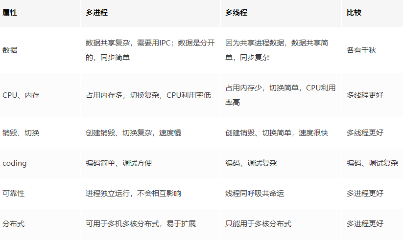

## Node
Node.js 是 Javascript 在服务端的运行环境，构建在 chrome 的 V8 引擎之上，基于事件驱动、非阻塞I/O模型，充分利用操作系统提供的异步 I/O 进行多任务的执行，适合于 I/O 密集型的应用场景，因为异步，程序无需阻塞等待结果返回，而是基于回调通知的机制，原本同步模式等待的时间，则可以用来处理其它任务，

- node单线程
  >Node.js 虽然是单线程模型，但是其基于事件驱动、异步非阻塞模式，可以应用于高并发场景，避免了线程创建、线程之间上下文切换所产生的资源开销。
  当你的项目中需要有大量计算，CPU 耗时的操作时候，要注意考虑开启多进程来完成了。

在单核 CPU 系统之上我们采用 单进程 + 单线程 的模式来开发。在多核 CPU 系统之上，可以通过 child_process.fork 开启多个进程（Node.js 在 v0.8 版本之后新增了Cluster 来实现多进程架构） ，即 多进程 + 单线程 模式。注意：开启多进程不是为了解决高并发，主要是解决了单进程模式下 Node.js CPU 利用率不足的情况，充分利用多核 CPU 的性能。

- node中的进程：
  - process模块
    Node.js 中的进程 Process 是一个全局对象，无需 require 直接使用，给我们提供了当前进程中的相关信息。
    ```
    process.env：环境变量，例如通过  process.env.NODE_ENV 获取不同环境项目配置信息
    process.nextTick：这个在谈及 Event Loop 时经常为会提到
    process.pid：获取当前进程id
    process.ppid：当前进程对应的父进程
    process.cwd()：获取当前进程工作目录，
    process.platform：获取当前进程运行的操作系统平台
    process.uptime()：当前进程已运行时间，例如：pm2 守护进程的 uptime 值
    进程事件：process.on(‘uncaughtException’, cb) 捕获异常信息、process.on(‘exit’, cb）进程推出监听
    三个标准流：process.stdout 标准输出、process.stdin 标准输入、process.stderr 标准错误输出
    process.title 指定进程名称，有的时候需要给进程指定一个名称

    以上仅列举了部分常用到功能点，除了 Process 之外 Node.js 还提供了 child_process 模块用来对子进程进行操作，
    ```
  - child_process模块：
   
   - Nodejs进程通信原理：实现进程间通信的技术有很多，如命名管道，匿名管道，socket，信号量，共享内存，消息队列等。Node中实现IPC（Inter-Process Communication）通道是依赖于libuv。windows下由命名管道(name pipe)实现，*nix系统则采用Unix Domain Socket实现。表现在应用层上的进程间通信只有简单的message事件和send()方法，接口十分简洁和消息化。
    !()[https://user-gold-cdn.xitu.io/2019/8/4/16c5b3812e3bb7d9?imageView2/0/w/1280/h/960/format/webp/ignore-error/1]
    父进程在实际创建子进程之前，会创建IPC通道并监听它，然后才真正的创建出子进程，这个过程中也会通过环境变量（NODE_CHANNEL_FD）告诉子进程这个IPC通道的文件描述符。子进程在启动的过程中，根据文件描述符去连接这个已存在的IPC通道，从而完成父子进程之间的连接。
    - 子进程对象send()方法可以发送的句柄类型:
    net.Socket TCP套接字
    net.Server TCP服务器，任意建立在TCP服务上的应用层服务都可以享受它带来的好处
    net.Native C++层面的TCP套接字或IPC管道
    dgram.Socket UDP套接字
    dgram.Native C++层面的UDP套接字
    **Node进程之间只有消息传递，不会真正的传递对象，这种错觉是抽象封装的结果。**
- nodejs进程守护：
  每次启动 Node.js 程序都需要在命令窗口输入命令 node app.js 才能启动，但如果把命令窗口关闭则Node.js 程序服务就会立刻断掉。除此之外，当我们这个  Node.js 服务意外崩溃了就不能自动重启进程了。这些现象都不是我们想要看到的，所以需要通过某些方式来守护这个开启的进程，执行 node app.js 开启一个服务进程之后，我还可以在这个终端上做些别的事情，且不会相互影响。当出现问题可以自动重启。
  - 第三方的进程守护框架，pm2 和 forever ，都可以实现进程守护，底层上都是通过 child_process 模块和 cluster 模块实现的。
  - Linux关闭一个进程：
    - 查找与进程相关的PID号：ps aux | grep server
    - 以优雅的方式结束进程：kill -l PID
    - 杀死同一进程组内的所有进程。其允许指定要终止的进程的名称，而非PID：killall httpd。

### NodeJS单线程
```
const http = require('http');

const server = http.createServer();
server.listen(3000,()=>{
    process.title='程序员成长指北测试进程';
    console.log('进程id',process.pid)
})
创建了http服务，开启了一个进程，都说了Node.js是单线程，所以 Node 启动后线程数应该为 1，但是为什么会开启7个线程呢？
```
>Node 中最核心的是 v8 引擎，在 Node 启动后，会创建 v8 的实例，这个实例是多线程的。
    - 主线程：编译、执行代码。
    - 编译/优化线程：在主线程执行的时候，可以优化代码。
    - 分析器线程：记录分析代码运行时间，为 Crankshaft 优化代码执行提供依据。
    - 垃圾回收的几个线程。

Node 是单线程的指的是 JavaScript 的执行是单线程的(开发者编写的代码运行在单线程环境中)，但 Javascript 的宿主环境，无论是 Node 还是浏览器都是多线程的因为libuv中有线程池的概念存在的，libuv会通过类似线程池的实现来模拟不同操作系统的异步调用，这对开发者来说是不可见的。

#### Libuv
Libuv 是一个跨平台的异步IO库，它结合了UNIX下的libev和Windows下的IOCP的特性，最早由Node的作者开发，专门为Node提供多平台下的异步IO支持。Libuv本身是由C++语言实现的，Node中的非阻塞IO以及事件循环的底层机制都是由libuv实现的。



