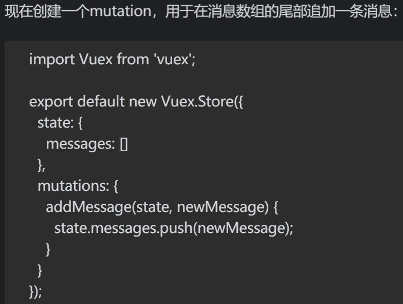

**vuex可以满足复杂应用中多个组件进行状态共享的需求。**
1. state及其辅助函数
   state表示数据在vuex中的存储状态，它就像一个在应用的任何角落都能访问到的庞大对象——是的，它就是单一数据源（single source of truth）。
   
   辅助函数mapState，它返回一个被用作计算属性的函数对象。
    
    
    
2. getter及其辅助函数
   数组写法：computed:mapGetters(['unread','unreadFrom'])
   
3. mutation：修改state对象的值
   mutation是一个函数，它对state进行同步变更，通过调用store.commit()并传入mutation名称的方式来达成。
   使用方式：
   
    

    mutation辅助函数：
    数组写法：methods：mapMutations(['addMessage'])
    

    >> **Mutation必须是同步函数**,mutation只能实现同步变更state对象。如果需要实现异步变更，那么应该使用action。
4. action:异步变更
   
   context对象即等于vuex的store——或者说是当前的vuex模块。通过context对象，可以访问到state（即它的state属性），不过不能直接修改它——还是得通过提交mutation来变更。
   
   
5. promise与action
   action是异步函数，我们怎么知道它们已经完成了呢？可以观察计算属性的改变，但这不够理想。   
   其实可以在action中返回一个promise对象来代替上述做法。另外，调用dispatch也会返回一个promise对象，运用它就可以在action运行结束时去运行其他代码。  
   
   
6. vuex，可以将store拆分到各个模块
   每个module都只是一个对象，并且拥有其自身的state、getter、mutation以及action，通过使用modules属性即可将它们添加到store当中。
7. vue-test-utils单元测试
   注意.find()仅返回第一个满足选择器规则的元素节点。如果希望得到多个，请使用.findAll()。它会返回一个WrapperArray对象，而不是Wrapper，但是它具有类似的方法，不过需要使用.at()方法来返回WrapperArray中指定索引的目标元素节点。
   
   