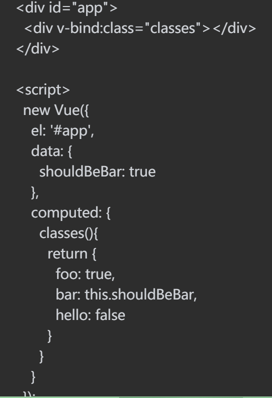
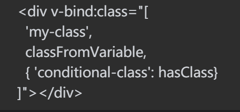
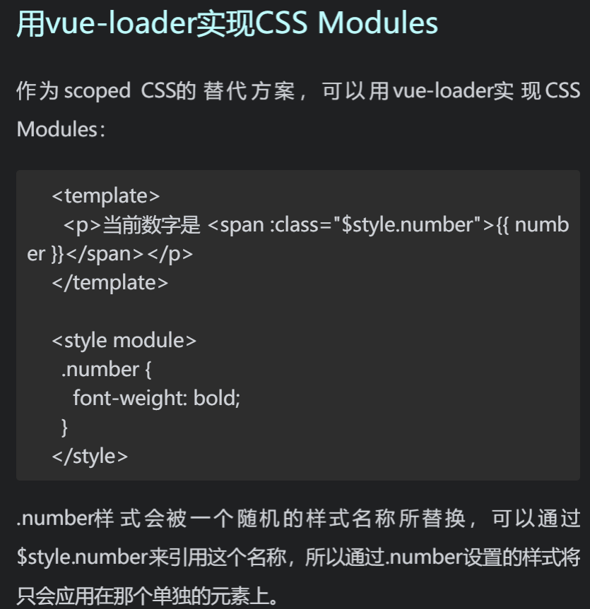
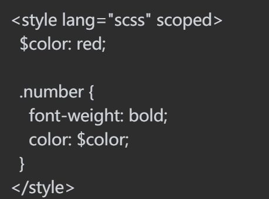
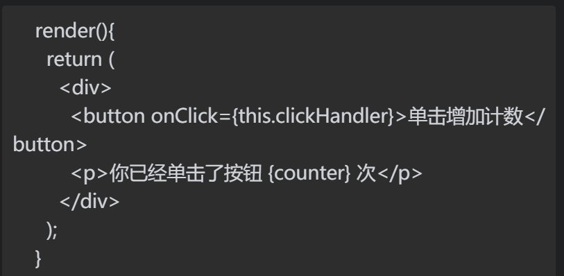
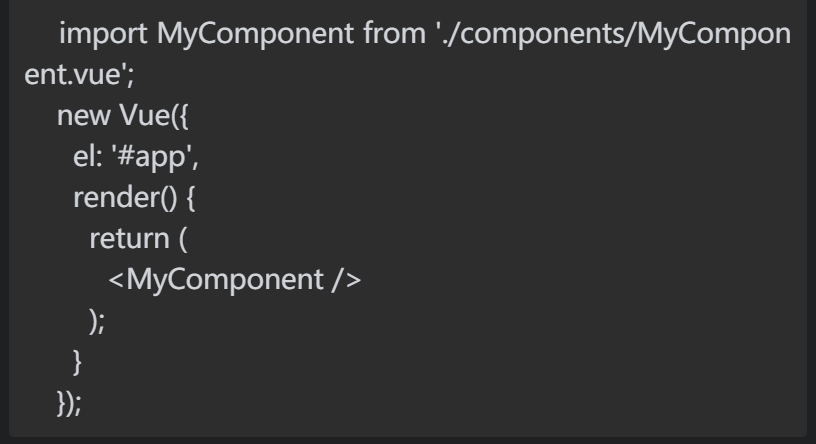
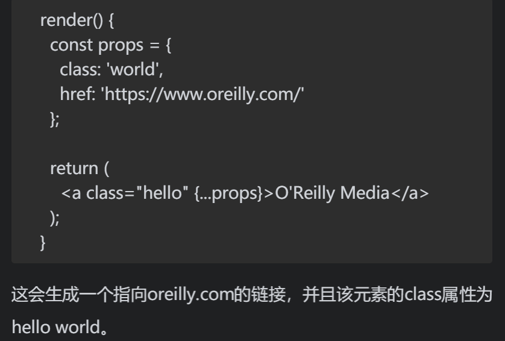

1. class绑定
    数组形式：`

`   
    对象形式：`{ 'my-class':shouldAddClass }`
    
    混合使用：
    
2. 内联样式绑定
   `

`
   `

`
   多重值：
   `

`
3. 与JavaScript不同，组件中的CSS不仅会影响自身，还会影响到页面上所有的HTML元素。Vue有一种方式可以修复这个问题：scoped CSS。如果我们在style标签上添加了scoped特性，Vue就会自动处理关联的CSS与HTML，使编写的CSS只影响到该组件中的HTML.
   正如我现在所遇到的，为什么我在一个vue文件写的样式，无需导入，在其他文件也可以使用，就是因为有共同的父组件。
   
   
4. vue中的render()与jsx
   安装了babel插件后，render函数与react无异
   
   
   