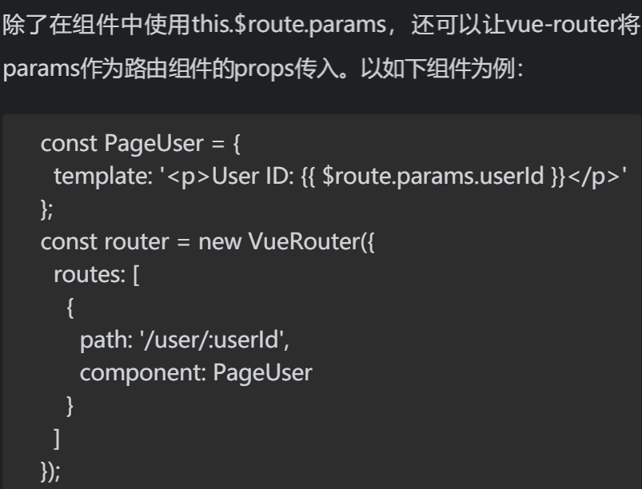
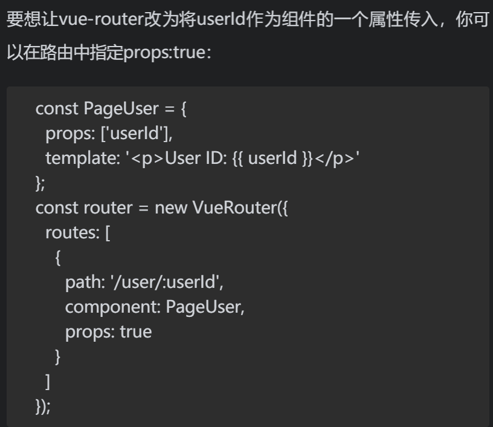
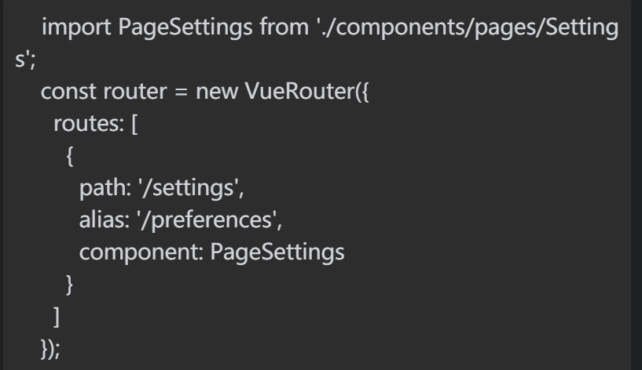
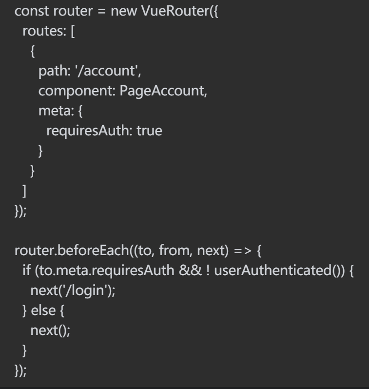
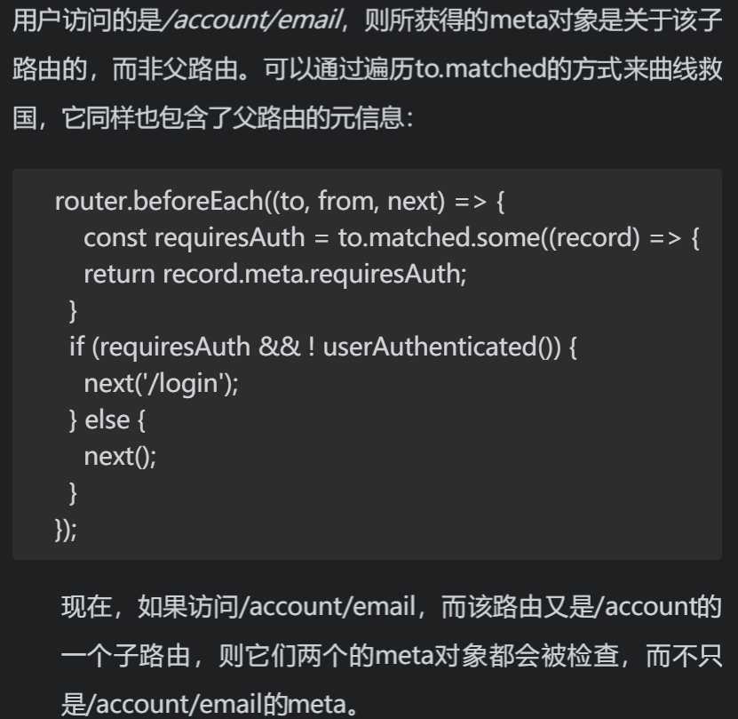
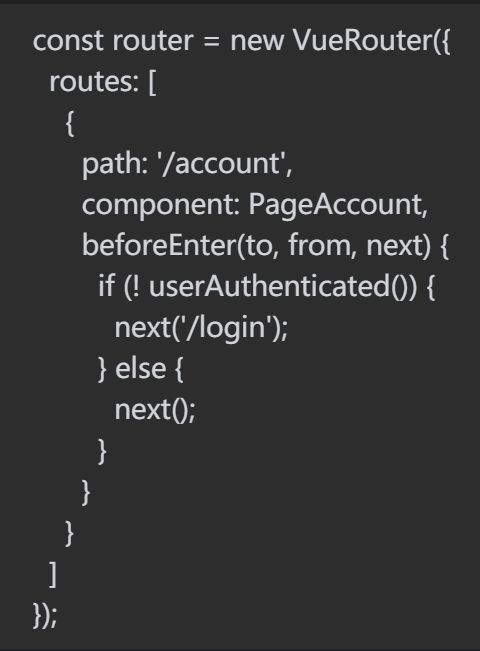
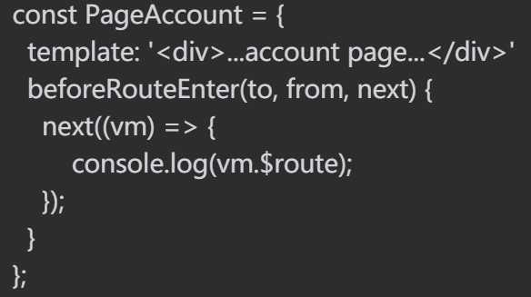
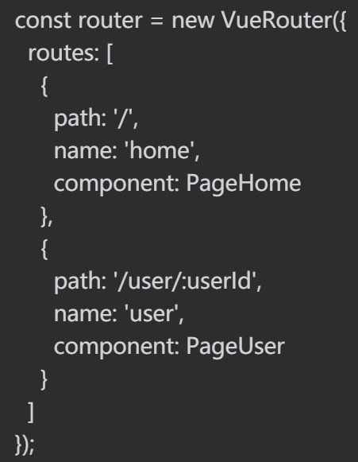
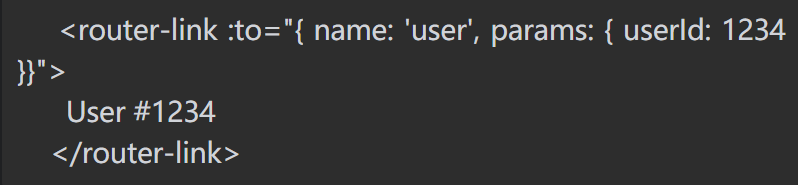

1. hash路由：默认是hash模式
   http://.../#about
   hash路由一个明显的标志是带有#,我们主要是通过监听url中的hash变化来进行路由跳转。
2. HTML新路由方案——History API:vue-router中设置mode：'history'  
    简单API
   ```
    window.history.back();       // 后退
    window.history.forward();    // 前进
    window.history.go(-3);       // 后退三个页面
    ```
    history.pushState用于在浏览历史中添加历史记录,但是并不触发跳转,此方法接受三个参数:
    - state:一个与指定网址相关的状态对象，popstate事件触发时，该对象会传入回调函数。如果不需要这个对象，此处可以填null。
    - title：新页面的标题，但是所有浏览器目前都忽略这个值，因此这里可以填null。
    - url：新的网址，必须与当前页面处在同一个域。浏览器的地址栏将显示这个网址。
    history.replaceState方法的参数与pushState方法一模一样，区别是它修改浏览历史中当前纪录,而非添加记录,同样不触发跳转。
    popstate事件,每当同一个文档的浏览历史（即history对象）出现变化时，就会触发popstate事件.
    仅仅调用pushState方法或replaceState方法 ，并不会触发该事件，只有用户点击浏览器倒退按钮和前进按钮，或者使用 JavaScript 调用back、forward、go方法时才会触发。
3. 动态路由：
    ```
    routes:[
        {
            path:'/user/:userId',
            component:pageUser
        }
    ]
    ```
    在组件实例中，可以通过使用属性this.$route来获取当前的路由对象。这个对象包括了一些有用的属性，诸如当前被访问的完整路径、URL的查询参数（例如：? lang=en）等。就本例而言，最有用的属性莫过于params，它包含了被动态匹配的URL的各个部分。在本例中，如果访问/user/1234，那么params就等于：
    {
        "userId":"1234"
    }

4. 响应路由变化
    当/user/1234与/user/5678相互切换时，其中相同的组件会被重用，于是一些生命周期钩子，诸如created，mounted，都不会被调用。不过，你可以使用beforeRouteUpdate导航守卫（guard）在URL动态部分变化时运行一些代码。
    ```
    beforeRouteUpdate(to,from,next){
        this.state='loading';
        this.init()......//获取将要去的页面的数据竟然也可以
        next();
    }
    ```
    
    

5. 重定向和别名
    如果你想让设置页面从/settings和/preferences都可被访问，可以给/settings路由取一个叫/preferences的别名：
    

6. 链接导航<router-link to="/user/1234">
    router-link的重要属性：
    - tag属性：由于link默认渲染的是a标签，虽然取消了a标签的单击事件产生的处理自身导航的默认行为，而是使用vue的事件监听器，但仍保留了一些原生浏览器行为，比如悬停可以看到连接的信息，鼠标右键在新窗口打开链接，屏幕阅读器的辅助技术也可以识别这个链接。
    所以使用tag属性渲染为其他标签时，为了保留上面链接的浏览器行为，可以使用如下：
    `<router-link to="/user/1234" tag="li"><a>Go to User # 1234</a></router-link>`
    - active-class属性：当<router-link>组件的to属性中的路径与当前页面的路径相匹配时，链接就被激活了（active）。假如处在/user/1234，那么该链接就是激活的。
    当链接被激活时，vue-router会自动为生成的元素赋予一个类（class）。在默认情况下，这个类是router-link-active，不过你可以通过使用active-class属性来配置这个类。这很有用，特别是当你正在使用一个UI库，或者基于已有的代码时，而其中的链接激活类已经被设置成了其他名称。比如，你正在使用Bootstrap制作一个导航栏（navbar），就可以设置当前被激活的链接的类名为active。
    `<router-link to="/user/1234" tag="li" active-class="active"><a>Go to User # 1234</a></router-link>`
    - 原生事件：
    `<router-link to="/user/1234" @click.native="handleClick>Go to User # 1234</router-link>`
    单击这个链接时，handleClick就会被调用。
7. 编程式导航：这些方法效仿浏览器原生的history方法——如history.pushState()、history.replaceState()以及history.go()   
    - 可以用router.push()（或组件实例中的this.$router.push()）来进行路径跳转：router.push('/user/1234'); 这与单击一个to属性为/user/1234的<router-link>组件完全等效——事实上，当你单击<router-link>时，vue-router内部用的就是router.push()方法。
    - router.replace()方法，与router.push()的表现类似：都是将你导航至指定的路由。不同之处在于，router.push()会向history栈添加一个新的记录——因此，如果用户按下返回键，路由器就会跳转到上一个路由——而router.replace()则替换了当前的history记录，所以返回键只能让你回到之前的路由。
    -router.go()，它能让你在历史记录中前进和后退，就像按了前进键和后退键。后退一条记录，你就用router.go(-1)，而前进10条记录，就用router.go(10)。如果历史中没那么多条记录，函数的调用就会悄悄终止。

8. 导航守卫
    vue-router提供了能让你在导航发生之前运行某些代码的功能，并且遵照你的意愿去取消导航或将用户导航至其他地方。
    - router.beforeEach()守卫：传入3个参数：to、from以及next，其中from和to分别表示导航从哪里来和到哪里去，而next则是一个回调，在里面你可以让vue-router去处理导航、取消导航、重定向到其他地方或者注册一个错误。
     >>在守卫中一个个去检查路径会让程序变得冗长且使人迷惑，特别是当你维护的是一个拥有大量路由的网站，于是会发现另一个很有用的特性，它就是路由元信息（route meta fields）。你可以在路由上添加一个meta属性，并在守卫那里重新获取它。例如，在account路由上设置一个requiresAuth属性，然后在守卫中查看该属性：
    
    
    - afterEach:传入两个参数，to和from
    - 路由独享守卫：beforeEnter守卫与beforeEach表现完全一致，只不过这种守卫作用于每一个单独的路由而非所有。
        
    - 组件内部守卫：beforeRouteEnter（等效于beforeEach）、beforeRouteUpdate以及beforeRouteLeave（在导航离开一个路由时调用）
        注意，在beforeRouteEnter中this是undefined，因为此时组件还尚未被创建。但是，可以在next里传一个回调，该回调会被传入组件实例并作为其第一个参数：
        
        
        鉴于你在beforeRouteUpdate和beforeRouteLeave里都能使用this，就像在组件内的其他大部分地方一样，因此这两个守卫并不支持在next里传入一个回调。
9. 路由命名：
    
    可以使用名称来代替路径进行链接了：
    `<router-link :to="{name:'home'}" >return to home</router-link>`
    `router.push({name:'home'})`
    要想像之前的user路由那样把路由与params关联起来，你可以在to对象的params属性中指定：
    


**vue-router基本知识：**
    <router-view> 自动匹配routes中设置的路由


